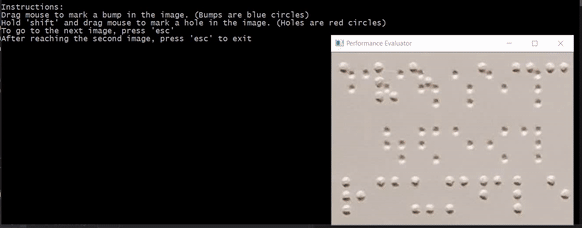

# Computer Vision Algorithm Performance Evaluator

## Overview

An interactive ground truth labelling program that allows a user to mark bumps and holes on a set of Braille images. The labeled regions are then compared against pre-processed algorithm data. This then determines how well the algorithm has performed compared to what the user has determined as the ground truth. 

## Tools

This project utilizes the [OpenCV](https://opencv.org/ "OpenCV Home Page") library. It is a library made for real-time computer vision functionality and machine learning analysis.

## F-Measure Calculation

[F-Measure](https://en.wikipedia.org/wiki/F1_score "F-Measure Wiki Page") is the quantitative measure of how well a given machine learning algorithm has performed based on how correct and incorrect predictions.

#### F-Measure Equations

See definitions for *TP, FN and FP* in the **Confusion Matrix** section below.

*Recall = TP / (TP + FN)*

*Precision = TP / (TP + FP)*

*Fβ* *=* *( 1 + β 2 )* *+* *( Precision * Recall ) / ( β  2 * Precision) + Recall ), where β = 1*

The value of *Fβ* is the percentage accuracy of the machine learning algorithm.

## Confusion Matrix 

A [confusion matrix](https://en.wikipedia.org/wiki/Confusion_matrix "Confusion Matrix Wiki") let's you visualize the performance in a numerical table format.

#### Confusion Matrix Used

| Legend |                                                                                                  |
|--------|--------------------------------------------------------------------------------------------------|
| **TP** | True positive, the algorithm has detected what it is intended to detect.                         |
| **FP** | False positive, the algorithm has detected what it is looking for. But it is not actually there. |
| **FN** | False negative, the algorithm was supposed to detect the target, but instead did not.            |

 

|                    | Truly a bump | Truly a hole | Truly None | 
|--------------------|--------------|--------------|------------|
| Detected as a bump | **TP**       | **FP**       | **FP**     |   
| Detected as a hole | **FP**       | **TP**       | **FP**     |  
| Detected as null   | **FN**       | **FN**       | Null       |

## Demonstration GIF

